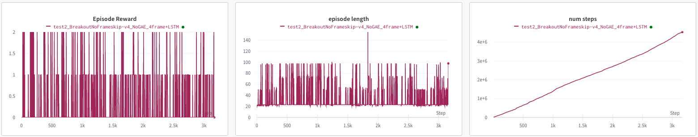

# Training Atari Game Agents Using A3C  
## Run
<pre>
<code>
python main.py --env-name "BreakoutNoFrameskip-v4" --num-processes 1 --exp eval
python main.py --env-name "BreakoutNoFrameskip-v4" --num-processes 12 --exp train
</code>
</pre>

## 실험 환경
- Apple M1 Pro 칩

  8코어 CPU(성능 코어 6개 및 효율 코어 2개)
- 12 multi-processes

## 실험 조건
- 5000,000 step만 실행 
- 실행한 Atari Game 종류
    1. Pong   

        

    2. Breakout   

        
        
    3. SpaceInvaders   

        
        
    4. Boxing   

        
        
    5. IceHockey   

          
- WandB 이용

## Hyperparameters 
- Learning rate = 0.0001
- No Learning Scheduler (성적이 좋지 않음)
- Adam Optimizer 
- Seed = 1 + rank
- Image Size (H, W, C): [210, 160, 3] => [84, 84, 1] 
- N-step = 20
- Gamma = 0.99
- Entropy Coefficient = 0.01
- Value Loss Coefficient = 0.5

## Input Representation & Env Customization
Atari Wrapper 이용하여 Environment Customization
- __NoopResetEnv(noop_max=30)__

    Reset후 no-ops에 해당하는 숫자를 랜덤하게 취해서 initial state sampling  
    
        
- __MaxAndSkipEnv(skip=4)__  

    Return only every skip-th frame (frameskipping)
    Step the environment with the given action Repeat action, sum reward, and max over last observations.
    frame skipping    
    

- __EpisodicLifeEnv__  

    Make end-of-life == end-of-episode, but only reset on true game over. Done by DeepMind for the DQN and co. since it helps value estimation.(Agent가 죽는 시점을 episode끝으로 보고, done을 반환 후 reset한다.)  
    

- __ClipRewardEnv__  

    Clips the reward to {+1, 0, -1} by its sign.  
    

- __WarpFrame (Input Representation)__

    Convert to grayscale and warp frames to 84x84 (default) as done in the Nature paper and later work.  
  
- __Pixel Normalization__
    255로 나누어 픽셀 값을 0~1사이로 정규화

  

  
    
## Model Archiecture

  

  
## Loss
- __Advantage__ 
- __N-step Return__
- __Entropy Regularization Term 이용__

### 최종 Loss  
### $L = L_{\pi}+c_vL_v+c_eL_{entropy}$    
- $L$ = 최종 Loss
- $L_{\pi}$ = Actor Loss
- $L_{v}$ = Critic Loss
- $L_{entropy}$ = Entropy Regularization Term
- $c_v$ = value coefficient
- $c_e$ = entropy coefficient  

### Critic Loss
### $L_v = (r_{t+1}+ \gamma r_{t+2}+ \gamma^2 r_{t+2}... + \gamma^{19} V_v(s_{t+20})-V_v(s_t))^2 +(r_{t+2}+ \gamma r_{t+3}+ \gamma^2 r_{t+4}... + \gamma^{18} V_v(s_{t+20})-V_v(s_{t+1}))^2 + ... + (r_{t+19}+ \gamma V_v(s_{t+20})-V_v(s_{t+19}))^2$

### Actor Loss

  
## Experiment Score Graph
### Pong
- Train   

- Test

### SpaceInvaders
- Train

- Test

### Breakout
- Train

- Test

### IceHockey
- Train

- Test

### Boxing
- Train

- Test
    

Pong외에 안정적인 결과가 나온 실험이 거의 없다.   

## Shared Model 작동 원리
- Multiprocessing of Pytorch
다른 process들에게 shared views on the same data를 제공하는 shared_memory를 이용한다. 
tensor/storage가 shared_memory로 이동하면 copy필요없이 텐서나 스토리지를 자유롭게 다른 process로 전송할 수 있다.
    
Global weight를 지니는 shared model은 
     

이와같이 선언하는데, shared memory를 통해서 global memory를 이용하겠다는 의미다.  
하지만 참고한 코드중에, shared_grad에 local_grad를 처음 프로세스가 생성되고 한번만 할당하는 것을 발견했다.   
    

맞는 코드인가 싶어서 찾아보니, multiprocessing에서 각 프로세스는 shared memory의 data(weight)는 공유하지만 grad는 공유하지 않는다고 한다. grad는 각 프로세스마다 local로 가지며, 각자local model의 loss backward를 통해서 grad를 계산하고 local grad를 통해 global model의 parameter를 올린 optimizer를 이용해서 global weight를 갱신한다.  
__한마디로 각 프로세스마다 각자의 grad를 가지고 배울 수 있도록 하기 위해서라고 할 수 있다.__  

## 보완 실험  
그나마 쉬운 task임에도 성적이 좋지 않았던 Breakout에 대해 보완 실험을 진행해보았다.    
Input과 model의 부실함이 원인인 것 같아서 기존 Model에  
Image 4 stack + BatchNorm2d 추가 + 2번째 conv layer 64채널로 증가  
하였으나 결과가 비슷했다.   

  

- Reference  

https://github.com/ikostrikov/pytorch-a3c  
https://stable-baselines3.readthedocs.io/en/master/common/atari_wrappers.html  
https://towardsdatascience.com/deep-q-network-dqn-i-bce08bdf2af

  
